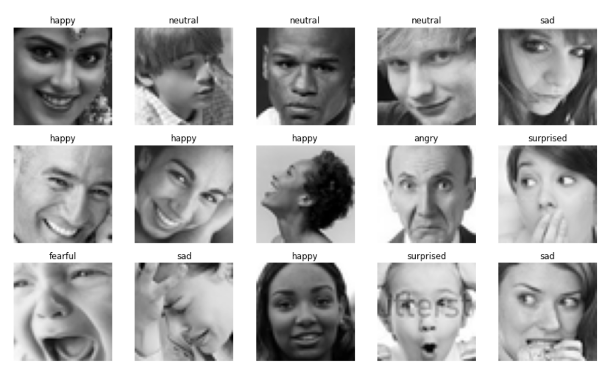
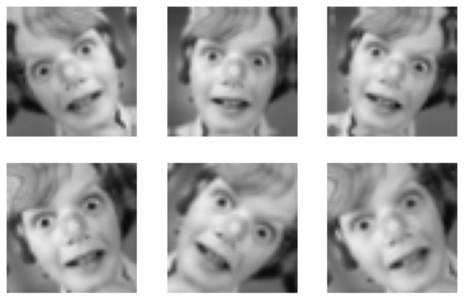
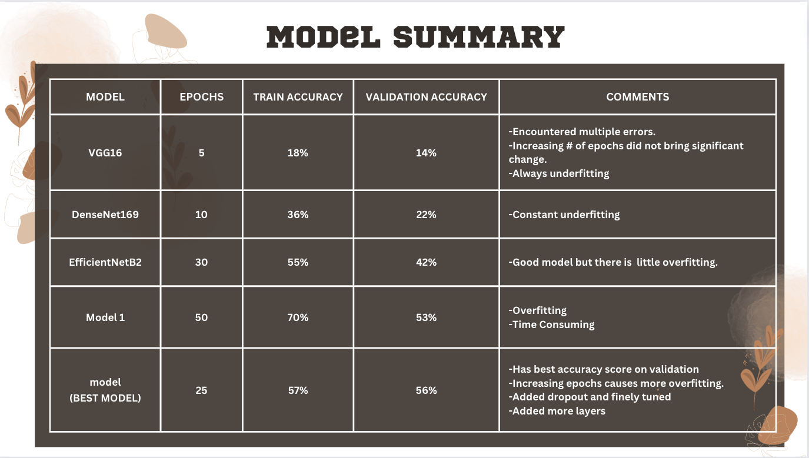
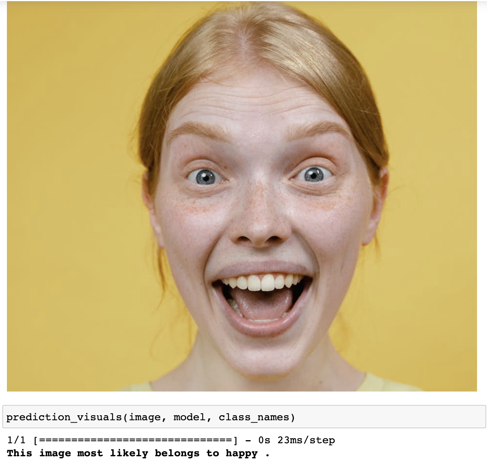
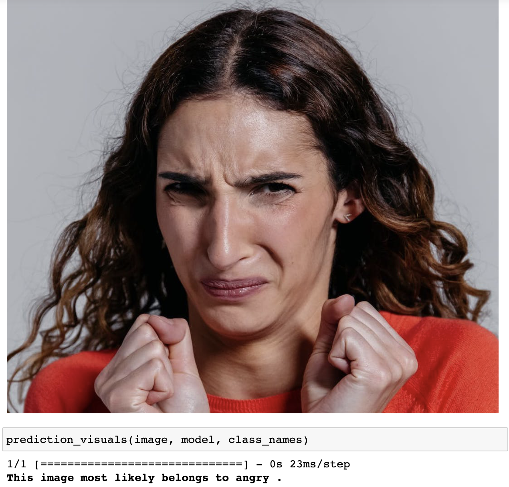
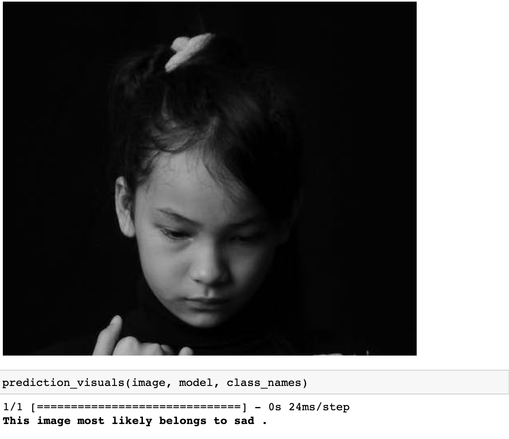
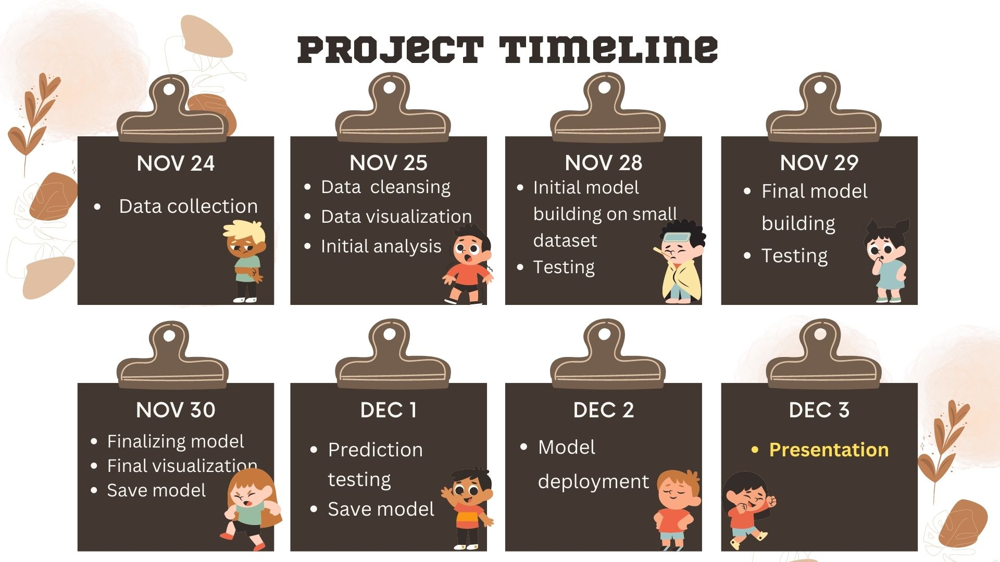

<h1 align="center"> 😡🤮😱 EMOTION DETECTION 😀😐🙁🤯</h1> 
<h3 align="center">IMAGE CLASSIFICATION MODEL</h3> 

## ⭐⭐ Proposal

The emotion detection image classification project is mainly about reading the emotions of people through their pictures. The aim of this project is to correctly identify the photos with their corresponding emotional class. The model will input images, evaluate the photos and return the emotion class it has predicted.

## ⭐⭐ Preprocessing Steps

### 1. Data Collection
The data was collected from [Kaggle Emotion Detection](https://www.kaggle.com/datasets/ananthu017/emotion-detection-fer?select=train). The data folder mainly consists of two folders that contains image files. **Train folder** contains 7 classes of emotions that has 28,571 photos in total. **Test folder** also contains 7 classes of emotions and 7,178 images in total. The files contain 48 x 48 pixels grayscale photos.

### 2. Data Visualization
<h5 align="center">SAMPLE PHOTOS WITH CLASS NAMES</h5> 

### 3. Data Cleansing

The data collected contained photos that were blank, corrupted and misclassified. In order to fix this, manual distribution of the images to their respective folders was done and corrupted and blank images were removed.

### 4. Loading and Splitting Data
The data was loaded straight from the computer's directory and was splitted in 3 separate datasets:
        ** a. train_ds** - contains training dataset with 80% of the images
        ** b. val_ds** - contains training dataset with 20% of the images
        ** c. test_ds** - contains test dataset
        
### 5. Data Augmentation
This helps in artificially adding more sample data by transforming image and it lessen the chances of overfitting. 
<h5 align="center">SAMPLE DATA AUGMENTED PHOTOS</h5>

## ⭐⭐ Model Creation
For this project, multiple models were created by using pre-trained models (VG16, DenseNet and Efficientnet) and stacking different layers of tensorflow keras and tuning them. 

 **MODEL SUMMARY CHART**
 For more information about EfficientNetB2 model and Best model: check .ipynb files.

## ⭐⭐ Predictions
 Photos were taken from test dataset and free stock images websites.

 **1. Correct Emotion: Happy**

 **2. Correct Emotion: Disgusted**

 **3. Correct Emotion: Sad**

## ⭐⭐ Conclusion

The plot and the scores for the different datasets(train,validation,test) implies that the model will perform efficiently towards unseen data. The predictions show that 2 out of 3 photos were correctly predicted by our best model. The challenge was the dataset itself because the images were illustrating mixed emotions. This only means that we can not properly define certain emotions because every individual has his or her own way of expressing his/her own emotion. 

## ⭐⭐ Project Timeline

